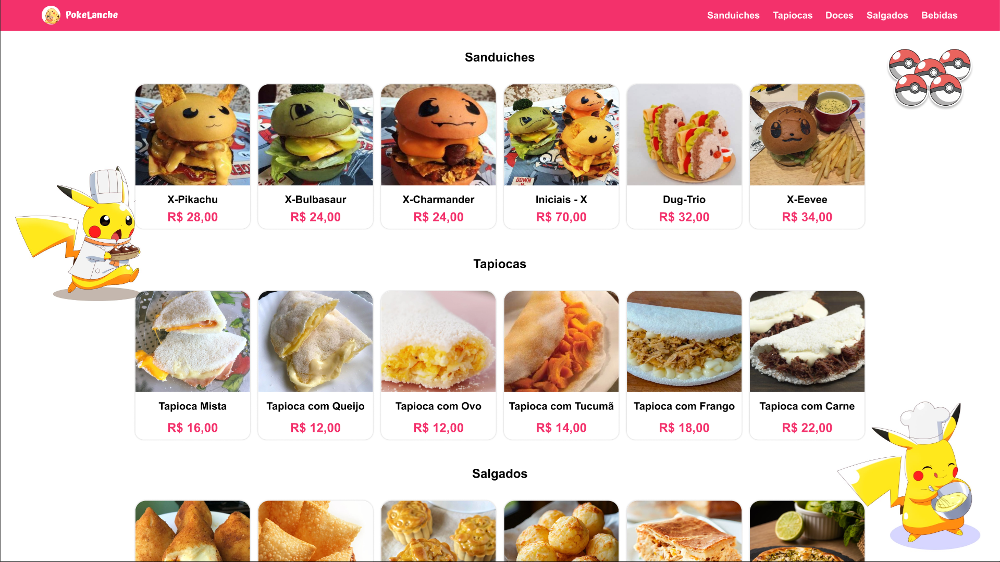

# 🍔 Pokelanche

Projeto fullstack utilizando Python no backend e Angular + Node no frontend + Figma no protótipo de UI.

Este projeto tem como objetivo ser uma aplicação para um pequeno restaurante ou cafeteria. Haverá uma área pública onde os clientes podem ver o cardápio e uma área administrativa onde o dono do estabelecimento pode gerenciar os itens.

Dentre as funcionalidades esperadas, estavam:

- Duas áreas distintas: uma pública (visualização) e uma administrativa (gerenciamento).
- Autenticação apenas para a área administrativa.
- Operações de CRUD para os itens do cardápio:
  - Criar: Adicionar um novo prato ou bebida.
  - Ler: Exibir os itens para os clientes e para o administrador.
  - Atualizar: Modificar os detalhes de um item (ex: mudar o preço).
  - Excluir: Remover um item que não está mais disponível.
- Upload de imagens para os itens do cardápio.
Obs: Funcionalidade de upload de imagens para os itens do cardápio.


Link do protótipo: 
```https://www.figma.com/design/0beYUIAVt0fLnTvG56IulG/Desafios?node-id=667-223&t=tb5oVi3X369xbSKj-1```

---

## 🚩 Solução

Criação de um cardápio digital temático de Pokémon. Com a capacidade de fácil mudança visual para ser adaptável para diferentes visualmente para diversos projetos.
Com isto em mente, o Pokelanche nasceu e com os objetivos sendo alcançados e ainda com novos horizontes sendo buscados. 
Dentre as funcionalidades adicionais, há:
    Dentre as funcionalidades adicionais, há:

- Alteração visual de produtos com base na sua disponibilidade.
- Estilização baseada em Pokémon.
- Fácil adaptabilidade visual dependendo do contexto do projeto.
- Uso de Arquitetura de Componentes com base no Angular 17+.


---

## 🚀 0. Pré-requisitos

Antes de começar, certifique-se de ter instalado:

- Python
- Angular e Node
- Git

---

## 📥 1. Clonar o projeto

`https://github.com/lucas-devstudies/pokelanche`

---

## 🐍 2. Configuração do Backend

Entre na pasta Backend:

`cd Backend`

### Criar ambiente virtual

`python -m venv venv`

### Ativar o ambiente virtual

Windows:  
`venv\Scripts\activate`

Linux/MacOS:  
`source venv/bin/activate`

### Instalar dependências

`pip install -r requirements.txt`

### Criar arquivo `.env`

Crie um arquivo `.env` com:

`SECRET_KEY = LffIrvCzab`  
`ALGORITHM = HS256`  
`ACESS_TOKEN_EXPIRE_MINUTES = 43200`

---

## 🖥️ 3. Executando o Backend

`uvicorn main:app --reload`

Acesse:  
`http://localhost:8000`

---

# 🛑 4. Atenção
É necessário que haja um usuário administrador no sistema. Acesse `http://localhost:8000/docs`

Na rota /auth/cadastrar preencha os campos de email e senha. Com isso feito, posteriormente você poderá acessar a dash do administrador no sistema.

---

## 🅰️ 5. Executando o Frontend (Angular)

Entre na pasta Frontend:

`cd Frontend`

Instale as dependências:

`npm install`

Execute o servidor:

`ng serve`

Acesse:  
`http://localhost:4200`

Observação: para acessar o painel de administrador, acesse:
`http://localhost:4200/login`

---


## 👨‍💻 Autor

Projeto mantido por:

- Lucas Ferreira (@lucas-devstudies)  
- Matheus Nobre (@matheushnobre)  
- Robert Cruz (robbydevs)

---
